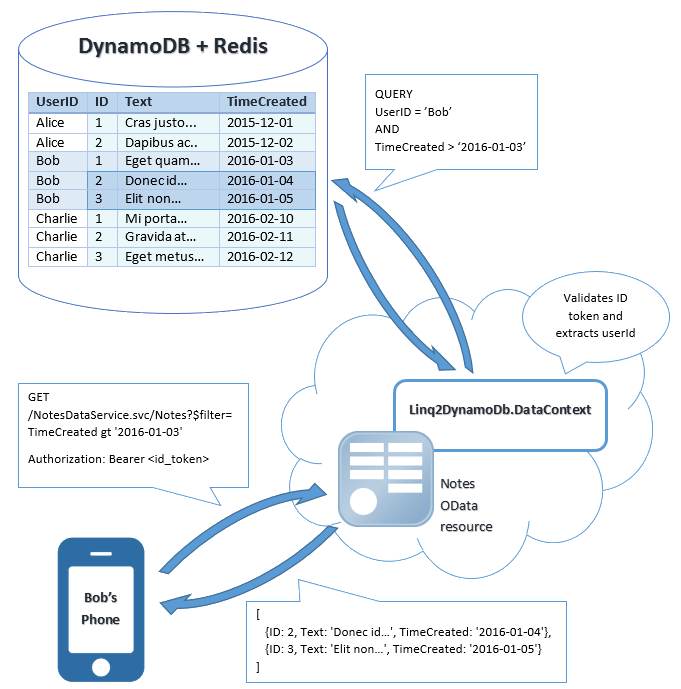

# DynamoDB + ElastiCache + Linq2DynamoDB + OData. Theory.

In my first post here I'm going to talk about software development for [AWS](http://aws.amazon.com/) with C#. Doesn't that sound weird? Seems that no one programs in C# for AWS :) But in fact, all the discussion below is intended to make your C# code as few as possible, when creating cloud services based on AWS [DynamoDB](http://aws.amazon.com/dynamodb/). And to get some good results, as I will try to show you.

## DynamoDB's concerns.

The biggest concern of DynamoDB as a cloud storage (no matter what platform or language you use for your service) is it's pricing rules, based on capacities. You need to predict the number of requests per second your system is going to produce. And you have to pay for those requests per second in advance. And if you fail to predict it precisely... then you might run into troubles, because DynamoDB starts throttling your requests. This throttling would either dramatically increase the latency or result in specific errors returned from DynamoDB. One of the possible strategies to handle those throttling errors would be to implement retries. But in either case your service just becomes very slow. Operations with normal latency of milliseconds might slow down to seconds and even minutes.

Things are getting even worse, when you use DynamoDB to build some kind of backend for mobile clients (or any other "non-human" clients). What a good mobile app does, when it fails to receive some data from the server? Exactly: it starts retrying. A common best practice is to do those retries with [exponential backoff](http://en.wikipedia.org/wiki/Exponential_backoff) strategy (with miltiplicatively increasing timeouts). But even if mobile developers didn't forget to implement it in a right way, the situation is still tricky. Each time the server doesn't respond within expected period of time, it gets another request. Which, in turn, increases the load to the server and the request rate to DynamoDB. Which, in turn, increases the number of request timeouts. Which, in turn... you got it :)

So, basically, when building mobile services around DynamoDB, it's very easy to run into the so called "positive feedback" black hole, provided that you have enough number of connected apps. Even a slight fluctuation in the incoming request rate may put your service down completely, until the capacity levels for your DynamoDB tables are increased (either manually or automatically).

In order to minimize the risk of getting into this problem and to reduce expences with DynamoDB, the obvious solution could be to implement caching of frequently accessed data in an in-memory cache, e.g. Memcached or Redis supported by [AWS ElastiCache](http://aws.amazon.com/elasticache/). But this would definitely introduce additional complexities to your server-side code - remember, one of the two hardest things in computer science is still cache invalidation.

Another concern is .Net-specific. Though the [Object Persistence Framework](http://docs.aws.amazon.com/AWSSdkDocsNET/V3/DeveloperGuide/dynamodb-intro.html#dynamodb-intro-apis-object-persistence) from AWS SDK for .Net does provide a type-safe way of accessing your DynamoDB data, this instrument is still not very .Net-friendly. It's DynamoDBContext class just gives you a basic set of CRUD operations and does not integrate well with all other .Net data access techniques. E.g. you can't just bind your data to ASP.Net [GridView](http://msdn.microsoft.com/en-us/library/system.web.ui.webcontrols.gridview(v=vs.110).aspx) or WPF [DataGrid](http://msdn.microsoft.com/en-us/library/system.windows.controls.datagrid(v=vs.110).aspx) control - some extra coding is required to make the data editable. And, of course, no LINQ support for querying your entities! :(

## Linq2DynamoDB to rescue.

This is where [Linq2DynamoDB](http://github.com/scale-tone/linq2dynamodb) gives you a hand. **Linq2DynamoDb.DataContext**'s usage paradigm is very close to Linq2Sql, Entity Framework, NHibernate and other similar ORMs. Apart from basic CRUD operations it implements some common patterns like [Unit of Work](http://martinfowler.com/eaaCatalog/unitOfWork.html) and [Lazy Loading](http://en.wikipedia.org/wiki/Lazy_loading).

**Linq2DynamoDb.DataContext** is the root object in your data hierarchy and is a kind of logical facade to your DynamoDB tables. The data is represented as collections of strongly-typed entities (C# classes). These collections are returned by **Linq2DynamoDb.DataContext.GetTable\<TEntity>()** method. And yes, you can run LINQ-queries against them, and those queries are actually [translated into GET, QUERY and SCAN operations](http://linq2dynamodb.codeplex.com/wikipage?title=Making%20queries&referringTitle=Documentation) against your DynamoDB tables. **Linq2DynamoDb.DataContext** keeps references to all loaded entities, and all the changes made to them are tracked. It also provides additional methods to [add and remove entities](http://linq2dynamodb.codeplex.com/wikipage?title=Creating%2c%20Removing%20and%20Updating%20entities&referringTitle=Documentation). However, all these modifications, additions and removals are stored in memory untill you call the **Linq2DynamoDb.DataContext.SubmitChanges()** method.

Furthermore, if you turn on Linq2DynamoDB's [caching mechanism](http://linq2dynamodb.codeplex.com/wikipage?title=Using%20In-Memory%20Cache&referringTitle=Documentation), **Linq2DynamoDb.DataContext** will start caching the results of your queries in a configured cache store (currently, both ElastiCache options - [MemcacheD](http://github.com/scale-tone/linq2dynamodb/tree/master/Sources/Linq2DynamoDb.DataContext.Caching.MemcacheD) and [Redis](http://github.com/scale-tone/linq2dynamodb/tree/master/Sources/Linq2DynamoDb.DataContext.Caching.Redis) - are supported). Not only the entities themselves are cached, but also the lists of their IDs, in form of indexes. So that the next time you do the same LINQ query (even if it happens on another computing instance), the results are returned from cache. When you modify your data (add/remove entities or change their fields), the indexes are updated accordingly, and next LINQ query returns up-to-date data from cache. This caching mechanism greatly reduces the number of read requests made to DynamoDB and dramatically decreases average latency. And it saves your money!

One more thing is that **Linq2DynamoDb.DataContext** always tries to keep the data in cache as much consistent, as possible and, so to say, trusts the cache more than the underlying DynamoDB table. What it means for you is that you always have your data strongly consistent (while, remember, strong read consistency in DynamoDB would [cost you twice as much money, as eventual consistency](http://docs.aws.amazon.com/amazondynamodb/latest/developerguide/HowItWorks.ProvisionedThroughput.html)). Of course, the latter point is true only when all data modifications are made via **Linq2DynamoDb.DataContext** with the same configuration parameters (if you e.g. change some values in your DynamoDB table via AWS console, **Linq2DynamoDb.DataContext** will not magically pick up your modifications).

## And about OData.

If you (like me) are designing cloud-connected mobile or [SPA](http://en.wikipedia.org/wiki/Single-page_application) applications, that work with data collections over HTTP, then you might already got used to using [OData](http://www.odata.org/) as the primary communication protocol. It standardizes all the CRUD operations for your entities and provides a simplified query language (a very reduced analog to SQL). If your client app is in JavaScript, then [AngularJS $resource](http://docs.angularjs.org/api/ngResource/service/$resource) module is everything you need to interact with OData entity collections ("resources" in OData terminology). Clients built on other platforms might make use of other OData-capable client libraries, luckily there are quite a few of them for all major platforms. For instance, [System.Data.Services.Client.DataServiceContext](http://msdn.microsoft.com/en-us/library/dd728278(v=vs.103).aspx) is what you would probably use in .Net/Silverlight/Windows Phone.

But unfortunately, DynamoDB does not support OData directly. To access your DynamoDB tables via OData you would need some kind of bridge. The combination of [WCF Data Services](http://msdn.microsoft.com/en-us/data/odata.aspx) and Linq2DynamoDB builds that bridge for you. The [System.Data.Services.DataService](http://msdn.microsoft.com/en-us/library/cc646779(v=vs.103).aspx) class is able to expose as an OData feed everything, that implements the [IUpdatable](http://msdn.microsoft.com/en-us/library/system.data.services.iupdatable(v=vs.103).aspx) interface. And the separate package [Linq2DynamoDb.AspNet.DataSource](http://github.com/scale-tone/linq2dynamodb/tree/master/Sources/Linq2DynamoDb.AspNet.DataSource) does contain the [IUpdatable interface](http://msdn.microsoft.com/en-us/library/system.data.services.iupdatable(v=vs.103).aspx) implementation for Linq2DynamoDB. So, all you need to do is to glue these two components together with a few lines of C# code. And probably, implement client authentication (if you really need to). Here Linq2DynamoDB helps you again: notice, that multiple overloads of **Linq2DynamoDb.DataContext.GetTable()\<TEntity>** method take hashKeyValue as the first parameter. This value is then used as a HashKey when making requests to your DynamoDB table and, in fact, makes your OData resources "user-specific". For instance, you could authenticate users on the client side via [OpenID Connect](http://en.wikipedia.org/wiki/OpenID_Connect), validate the **ID token** on the server side, extract **userId** from that token and use this **userID** as the **hashKeyValue** parameter. The picture below illustrates all this mechanics:

Other ways of obtaining the **hashKeyValue** are also possible. E.g. if your service supports [Windows Integrated authentication](http://weblogs.asp.net/scottgu/Recipe_3A00_-Enabling-Windows-Authentication-within-an-Intranet-ASP.NET-Web-application), then you could just pass **HttpContext.Current.User.Identity.Name** as a value for this parameter. The choice is up to you. 

## Wrapping up.

So, this purely theoretical post about creating cloud services with DynamoDB, ElastiCache, C# and OData is finally over. The [next](http://www.linkedin.com/pulse/dynamodb-elasticache-linq2dynamodb-odata-practice-lepeshenkov) [two](http://www.linkedin.com/pulse/dynamodb-elasticache-linq2dynamodb-ionic-practice-lepeshenkov) will be completely practical, and we'll be creating a simple OData service with Linq2DynamoDB and a mobile client application with [Ionic framework](http://ionicframework.com/) and [AngularJS](http://angularjs.org/). Please, stay tuned.
